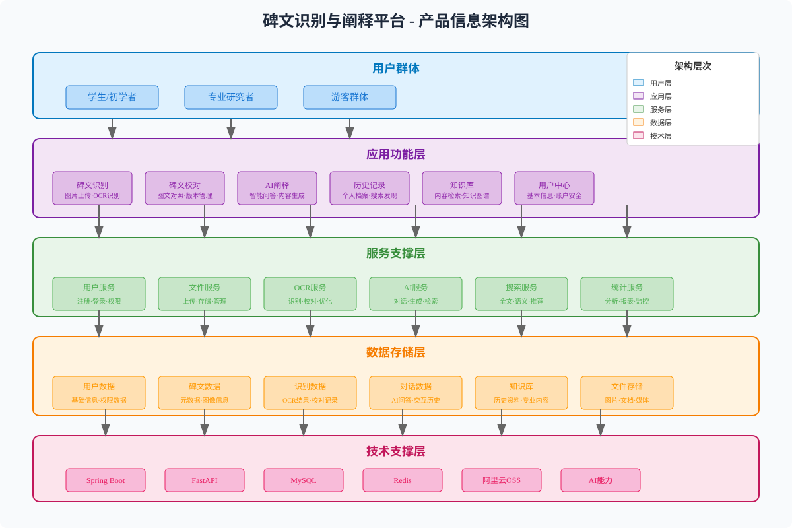
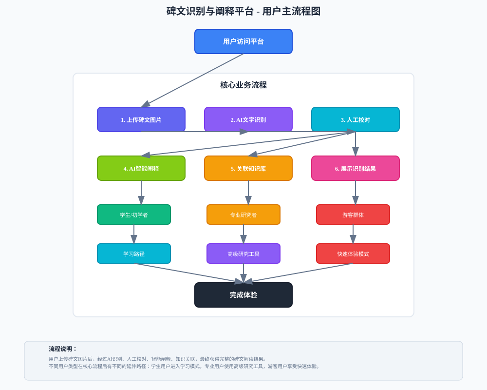

# 碑文识别与阐释平台 - 细化产品需求与设计文档

## 一、项目概况

### 1.1 项目背景

碑文识别技术已相对成熟，但对识别后文本的后续处理以及将晦涩的碑文转化为大众易懂的内容仍缺乏系统方案。**碑文识别与阐释平台**正是为填补这一空白而打造的全链路服务。

平台通过"识别-校对-阐释"的完整闭环，实现从碑文图像上传、高精度OCR识别、人工辅助校对到AI智能阐释的一站式体验。基于大语言模型和RAG技术，平台能够自动生成通俗化注释、历史背景、文化解读等多维度阐释，使即便是文史小白也能快速掌握碑文含义，让每一块碑文都能被大众轻松领会。

### 1.2 技术架构

平台采用前后端分离架构，集成多种AI服务实现碑文智能处理：

**前端展示层（当前原型）**：

- **Vue 3 UMD**：使用全局构建版本，通过 `<script>`标签直接引入，无需构建工具
- **Tailwind CSS**：采用CDN-JIT模式，已本地化存储确保离线可用
- **Font Awesome**：本地化图标资源，提供丰富的视觉元素
- **Vditor**：集成Markdown编辑器，用于文档展示和编辑功能
- **ECharts**：通过CDN加载，支持数据可视化展示
- **页面组织**：采用iframe方式组织各个功能页面，通过postMessage实现页面间通信

**前端演进规划**：

- 当前为快速原型阶段，使用静态HTML + iframe架构
- 后续计划引入Vite构建工具，实现模块化开发和路由管理
- 逐步从iframe架构迁移到Vue Router单页应用

**后端服务层（待实现）**：

- **Spring Boot**：负责API网关、用户管理、文件处理等核心业务
- **Python FastAPI**：专注AI服务集成，包括LLM调用和RAG检索
- **PolarDB MySQL**：存储用户数据、碑文信息和处理结果
- **阿里云OSS**：提供高可靠的文件存储服务

**数据架构设计**：

平台采用关系型数据库设计，以用户为中心构建核心数据模型，支持碑文全生命周期管理和AI智能阐释。数据库设计遵循逻辑外键原则，确保数据灵活性和扩展性，同时通过全文索引和复合索引优化查询性能。

**AI能力层（待集成）**：

- **看典古籍OCR API**：实现高精度碑文文字识别
- **通义千问大模型**：提供智能阐释和多轮对话能力
- **LangChain + FAISS**：构建RAG系统，增强知识检索和生成质量

### 1.3 产品信息架构

产品采用五层架构设计，从用户界面到技术基础，形成完整的系统架构：



**架构层次说明**：

- **用户层**：面向学生/初学者、专业研究者、游客群体三类用户
- **应用层**：核心功能模块包括碑文识别、AI阐释、历史记录、知识库等
- **服务层**：业务逻辑处理，涵盖用户管理、文件处理、AI服务集成等
- **数据层**：数据存储和管理，包括用户数据、碑文信息、知识库等
- **技术层**：基础技术支撑，涵盖前端框架、后端服务、数据库、AI能力等

### 1.4 用户主流程设计

用户从进入平台到完成碑文识别与阐释的完整流程如下：



**流程设计要点**：

1. **多入口适配**：根据用户类型（学生/研究者/游客）提供差异化入口
2. **核心流程标准化**：统一的上传→识别→校对→阐释→展示流程
3. **智能分支处理**：基于识别准确率自动调整后续处理路径
4. **个性化功能延伸**：核心流程后根据用户类型提供专属功能
5. **闭环体验设计**：确保用户获得完整的知识获取体验

## 二、用户需求与场景

### 2.1 用户画像

平台面向三类核心用户群体，每类用户都有独特的需求和使用场景：

**学生/初学者群体**

- **核心需求**：简洁操作，通俗阐释
- **使用场景**：课外遇到不理解的碑文，需要直观识别结果和通俗易懂的知识讲解
- **功能偏好**：优先展示AI对话界面，通过预定义模板快速获取知识
- **体验期望**：降低学习门槛，无需专业知识即可理解碑文内涵

**专业研究人员**

- **核心需求**：高精度识别 + 高效校对 + 专业检索
- **使用场景**：需要详细分析的碑文，要求高准确率文本输出和学术级背景资料
- **功能偏好**：优先展示识别结果校对界面，确保文本准确性后再进行深度阐释
- **体验期望**：提供便捷的校对工具和丰富的专业参考资料

**游客群体**

- **核心需求**：快速操作 + 趣味解读
- **使用场景**：旅游过程中遇到景点碑文，需要即时的轻量化讲解
- **功能偏好**：手机适配的简洁界面，拍照即识别，获取趣味性的碑文故事
- **体验期望**：贴合即时场景需求，提供轻松有趣的文化体验

### 2.2 场景化适配

基于不同用户群体的特征，平台在多个维度进行个性化适配：

**界面优先级适配（技术实现）**

- **动态路由配置**：基于用户类型自动调整功能模块的展示顺序和入口位置
- **组件懒加载**：根据用户偏好预加载相关功能模块，提升响应速度
- **布局自适应**：使用Vue动态组件和条件渲染实现界面元素的智能显示
- **导航个性化**：本地存储用户偏好设置，下次访问自动应用个性化布局

**内容深度适配（算法机制）**

- **文本复杂度分析**：基于TF-IDF和语言模型评估内容难度等级
- **用户认知水平建模**：通过交互行为、提问类型、停留时间等维度建立用户画像
- **动态内容生成**：使用大语言模型的temperature和top-p参数调节输出风格
  - 学生/初学者：temperature=0.8，生成更通俗易懂的表达
  - 专业研究者：temperature=0.3，生成更精确专业的表述
  - 游客：temperature=0.6，平衡趣味性和准确性
- **知识图谱映射**：基于用户已有知识推荐相关概念和扩展阅读

**交互方式适配（体验优化）**

- **学生/初学者**：

  - 引导式交互：使用步骤条、提示框、动画引导等组件
  - 模板化提问：预设20+常用问题模板，支持一键提问
  - 渐进式学习：从基础概念到深度知识的学习路径设计
  - 即时反馈：每个操作都有明确的视觉和文字反馈
- **专业研究者**：

  - 高效操作：快捷键支持、批量处理、高级搜索功能
  - 精确控制：详细的参数设置、自定义选项、专业工具集成
  - 数据导出：支持多种学术格式（BibTeX、EndNote等）
  - 版本对比：支持不同版本文本的详细对比分析
- **游客**：

  - 一键操作：核心功能一键完成，减少决策负担
  - 视觉化展示：丰富的图片、图标、动画效果
  - 分享功能：生成精美的分享卡片和二维码
  - 位置服务：基于GPS推荐附近的相关碑文（扩展功能）


## 三、核心功能流程

### 3.1 碑文识别流程

#### 3.1.1 图片上传与预处理

1. **多方式上传支持**

   - 拖拽上传：用户可直接拖拽图片文件到上传区域
   - 点击上传：传统文件选择器方式
   - 移动端优化：支持拍照上传和相册选择
2. **智能格式适配**

   - 支持JPG/JPEG、PNG、WebP等主流格式
   - 自动图片压缩和尺寸优化
   - 上传进度实时显示和错误处理
3. **上传预处理**

   - 图片质量检测和提示
   - 自动图片方向校正
   - 上传前的清晰度评估

#### 3.1.2 OCR智能识别

1. **高精度文字识别**

   - 调用看典古籍API，识别准确率>90%
   - 支持多种古代字体和书法风格
   - 提供文字坐标定位和置信度评分
2. **识别结果展示**

   - 图文对照显示，支持区域高亮
   - 识别置信度可视化展示
   - 整体识别统计信息（文字数量、准确率等）
3. **识别质量优化**

   - 智能图像增强预处理
   - 多轮识别结果对比
   - 低置信度区域自动标记

### 3.2 碑文校对流程

#### 3.2.1 智能校对界面

1. **图文对照编辑**

   - 左侧原始图片，右侧可编辑文本
   - 支持点击图片区域自动定位到对应文字
   - 实时同步滚动和高亮显示
2. **单字精确校对**

   - 点击单字显示放大图片
   - 展示OCR置信度和候选字列表
   - 支持手动输入修正和批量替换
3. **校对辅助工具**

   - 低置信度字词快速筛选
   - 相似错误智能检测和提示
   - 古文字典集成和专业术语建议

#### 3.2.2 校对质量管理

1. **版本控制**

   - 自动保存校对历史版本
   - 支持版本对比和差异显示
   - 一键回退到任意历史版本
2. **质量评估**

   - 实时计算校对完成度
   - 预估文本准确率提升
   - 生成校对质量报告
3. **导出功能**

   - 支持多种格式导出（TXT、DOCX等）
   - 可选择包含校对标记和注释
   - 生成专业的校对报告文档

### 3.3 AI阐释流程

#### 3.3.1 智能阐释引擎

1. **多维度内容生成**

   - **通俗释义**：用现代语言重新表述碑文内容，适配不同用户理解层次
   - **历史背景**：介绍碑文的历史年代、社会背景、相关历史人物和事件
   - **文化解读**：阐释文化内涵、象征意义、价值观念及其现代启示
   - **术语解析**：解释专业术语、典故引用、特殊表达和文言用法
   - **艺术价值**：分析书法风格、艺术特色、审美价值
   - **保护意义**：阐述文物保护的重要性和历史文化价值
2. **RAG增强生成技术实现**

   - **知识库构建**：基于FAISS构建多维度向量索引，包含历史文献、专业辞典、学术论文等
   - **检索策略**：采用混合检索（Dense + Sparse），结合语义相似度和关键词匹配
   - **上下文增强**：检索结果按相关度排序，选取Top-K片段作为生成上下文
   - **动态更新**：定期爬取权威历史网站和学术资源，更新知识库内容
   - **质量评估**：基于BLEU、ROUGE等指标评估生成质量，建立反馈优化机制

#### 3.3.2 交互式阐释体验

1. **对话式界面设计**

   - **流式输出**：基于Server-Sent Events实现逐字显示，提升用户体验
   - **Markdown渲染**：支持标题、列表、引用等格式，增强内容可读性
   - **代码高亮**：对古文特殊格式、专业术语进行视觉优化
   - **多轮对话**：基于Session管理维护对话上下文，支持深度交流
   - **响应优化**：采用异步处理和缓存机制，确保响应速度<2秒
2. **智能问答功能**

   - **划词提问**：集成文本选择API，支持精准选词提问
   - **预设模板**：基于用户类型提供差异化问题模板
     - 学生模板："这句话是什么意思？"、"有什么历史故事？"
     - 专业模板："这个典故的出处是？"、"相关考古发现有哪些？"
     - 游客模板："有什么有趣的传说？"、"这个碑文的价值是什么？"
   - **上下文理解**：基于全文Embedding实现语义理解和关联回答
   - **知识追溯**：展示参考文献、数据来源，确保信息可信度
   - **多语言支持**：支持文言-白话、简繁体、中英对照（扩展）
3. **个性化内容生成**

   - **用户类型适配**：基于用户类型调整内容深度和专业性
   - **风格适配**：为不同用户生成匹配的语言风格和表达方式

### 3.4 历史记录流程

#### 3.4.1 个人档案管理

1. **记录类型整合**

   - **碑文识别记录**：保存上传的图片、OCR结果、校对文本
   - **AI阐释对话**：完整记录与AI的问答交互过程
   - **用户操作轨迹**：收藏、标记、分享等行为记录
   - **学习进度跟踪**：个人使用习惯和偏好分析
2. **智能分类管理**

   - 按时间线自动组织历史记录
   - 支持自定义标签和分类
   - 基于内容主题的智能聚类
   - 重要记录置顶和收藏功能

#### 3.4.2 搜索与发现

1. **全文检索能力**

   - 支持碑文内容、AI阐释、用户笔记的全文搜索
   - 按朝代、字体、主题等维度筛选
   - 图片OCR文字内容可搜索
   - 搜索结果按相关性和时间排序
2. **知识发现功能**

   - 相似碑文的智能推荐
   - 热门内容和趋势发现


### 3.5 知识库流程

#### 3.5.1 知识库内容建设

1. **碑文数据收集**

   - **历史碑文收录**：系统收集各朝代经典碑文资料
   - **书法艺术展示**：不同书体风格的碑文案例
   - **文化内涵解读**：专业学者撰写的深度解析
   - **多维度标签**：按朝代、书体、主题等分类
2. **AI生成内容**

   - **智能标签生成**：基于内容自动提取关键词
   - **知识关联推荐**：发现碑文间的内在联系
   - **热门内容排行**：根据用户行为推荐优质内容
   - **个性化推荐**：基于用户兴趣推送相关内容

#### 3.5.2 智能搜索与发现

1. **多模态搜索**

   - **全文搜索**：支持标题、内容、标签的文本搜索
   - **语义搜索**：理解用户意图的智能搜索
   - **图片搜索**（扩展）：基于图片特征的相似搜索
   - **高级筛选**：多条件组合筛选和过滤
2. **知识发现功能**

   - **相关推荐**：基于内容相似性的智能推荐
   - **知识图谱**：展示人物、事件、地点的关联关系
   - **时间轴展示**：按历史时间线组织碑文内容
   - **地理分布**：基于地理位置的碑文分布展示


### 3.6 用户中心流程

#### 3.6.1 基本信息管理

1. **用户信息管理**

   - **基本信息**：头像、昵称、个人简介等
   - **账户安全**：密码修改、登录设备管理
   - **隐私设置**：个人数据的可见性控制

## 四、界面设计规范

### 4.1 设计原则

平台界面设计遵循以下核心原则，确保为不同用户群体提供最佳的使用体验：

**简洁性原则**

- 界面布局清晰明了，避免过度设计
- 核心功能突出，次要功能合理收纳
- 操作流程简化，降低用户学习成本
- 信息层次清晰，重要内容优先展示

**一致性原则**

- 统一的视觉风格和交互模式
- 标准化的组件设计和使用规范
- 一致的颜色体系、字体规范和图标风格
- 统一的反馈机制和操作逻辑

**可访问性原则**

- 支持键盘导航和屏幕阅读器
- 提供足够的颜色对比度
- 考虑不同能力用户的使用需求
- 支持多种输入方式和操作习惯

**响应式设计**

- 适配不同屏幕尺寸和设备类型
- 移动端优先的设计理念
- 灵活的布局方案和组件适配
- 优化的触摸操作和手势支持

### 4.2 界面布局规范

**主导航结构**

- 顶部导航栏：品牌标识、核心功能入口、用户信息
- 侧边导航：针对专业用户的高级功能快捷入口
- 底部信息：帮助中心、关于我们、联系方式等

**核心功能区域**

- 主工作区：占据页面主要空间，确保功能操作便利性
- 辅助信息区：相关提示、帮助信息、操作建议
- 状态显示区：当前状态、进度信息、错误提示

**响应式断点**

- 超小屏幕（<576px）：移动端专属布局
- 小屏幕（≥576px）：平板横屏和竖屏适配
- 中等屏幕（≥768px）：小型笔记本和平板适配
- 大屏幕（≥992px）：标准桌面显示器适配
- 超大屏幕（≥1200px）：大屏显示器和投影仪适配

### 4.3 交互设计规范

**当前原型交互方式**：

- **页面切换**：通过iframe加载静态HTML页面，使用postMessage进行跨页面通信
- **导航机制**：左侧树形导航控制右侧预览区页面切换
- **响应式预览**：支持Web端和移动端两种预览模式切换
- **键盘导航**：支持左右箭头切换页面，ESC键退出预览模式

**正式版交互规范（待实现）**：

1. **RESTful API设计**

   - 统一响应格式：所有接口返回标准化的数据结构，包含状态码、消息说明和业务数据
   - 分页查询支持：列表类接口支持分页参数，控制返回数据量和页码
   - 错误处理机制：区分客户端错误和服务端错误，提供详细的错误描述

2. **认证授权**

   - Token认证机制：采用JWT令牌进行用户身份验证
   - 权限控制：基于用户角色控制接口访问权限，确保数据安全
   - 会话管理：支持用户登录状态维护和令牌刷新

3. **文件上传**

   - 多方式上传：支持拖拽、点击选择等多种上传方式
   - 文件验证：对上传文件进行类型、大小等安全检查
   - 进度反馈：实时显示上传进度和状态信息

## 五、部署方案

### 5.1 容器化架构

```yaml
# docker-compose.yml
version: '3.8'
services:
  frontend:
    build: ./frontend
    ports:
      - "80:80"
    depends_on:
      - backend
    
  backend:
    build: ./backend
    ports:
      - "8080:8080"
    environment:
      - DB_HOST=polardb
      - OSS_ENDPOINT=oss-cn-hangzhou.aliyuncs.com
    depends_on:
      - polardb
    
  ai-service:
    build: ./ai-service
    ports:
      - "8000:8000"
    environment:
      - DASHSCOPE_API_KEY=${DASHSCOPE_API_KEY}
      - KANDIAN_API_KEY=${KANDIAN_API_KEY}
    
  nginx:
    image: nginx:alpine
    ports:
      - "443:443"
    volumes:
      - ./nginx.conf:/etc/nginx/nginx.conf
    depends_on:
      - frontend
      - backend
```

### 5.2 环境配置

1. **开发环境**

   - 热重载支持
   - 调试工具集成
   - 日志详细输出
2. **测试环境**

   - 独立的测试数据库
   - API接口测试
   - 性能压力测试
3. **生产环境**

   - 优化镜像大小
   - 安全加固
   - 监控告警集成

### 5.3 部署脚本

```bash
#!/bin/bash
# 一键部署脚本

echo "开始部署碑文识别平台..."

# 1. 检查环境变量
check_env() {
    if [ -z "$DASHSCOPE_API_KEY" ]; then
        echo "错误：DASHSCOPE_API_KEY未设置"
        exit 1
    fi
    if [ -z "$KANDIAN_API_KEY" ]; then
        echo "错误：KANDIAN_API_KEY未设置"
        exit 1
    fi
}

# 2. 构建镜像
build_images() {
    echo "构建Docker镜像..."
    docker-compose build
}

# 3. 启动服务
start_services() {
    echo "启动服务..."
    docker-compose up -d
}

# 4. 健康检查
health_check() {
    echo "进行健康检查..."
    # 检查各服务状态
    docker-compose ps
}

# 执行部署流程
check_env
build_images
start_services
health_check

echo "部署完成！访问 http://localhost 查看应用"
```

## 六、数据架构设计

### 6.1 数据模型设计原则

平台采用关系型数据库设计，以用户为中心构建核心数据模型，支持碑文全生命周期管理和AI智能阐释。数据架构设计遵循以下原则：

**数据完整性**：确保用户数据、碑文信息、识别结果、AI对话等各环节数据的完整性和一致性
**扩展灵活性**：采用逻辑外键设计，支持未来功能扩展和业务变更
**查询高效性**：通过全文索引和复合索引优化，支持复杂查询和全文搜索
**安全隔离性**：用户数据严格隔离，支持多租户架构

### 6.2 核心数据实体

#### 6.2.1 用户基础数据
用户表存储平台注册用户的基本信息，包括：
- **身份标识**：用户名、邮箱、手机号等多种登录方式
- **个人信息**：昵称、头像、个人简介等展示信息
- **用户分类**：学生、研究者、游客三类用户类型
- **账户状态**：活跃、禁用等状态管理
- **安全信息**：密码哈希、最后登录时间等

#### 6.2.2 碑文核心数据
碑文记录表存储所有上传的碑文信息，包括：
- **基础信息**：标题、描述、朝代、具体年代、出土地点
- **艺术属性**：书体风格、材质、尺寸规格等技术参数
- **图像数据**：图片URL、尺寸、文件大小、MD5哈希值
- **状态管理**：处理状态（待处理、处理中、已完成、失败）
- **统计信息**：查看次数、创建时间、更新时间

#### 6.2.3 OCR识别数据
OCR识别结果表存储文字识别全过程数据：
- **识别结果**：识别的文本内容、整体置信度、识别字数统计
- **技术参数**：API提供商、处理时间、原始响应数据
- **质量评估**：置信度评分、错误信息记录
- **字符详情**：单字坐标定位、候选字符、校对状态

#### 6.2.4 校对管理数据
校对记录表存储人工校对过程和结果：
- **版本对比**：原始文本与校对后文本的完整记录
- **修改追踪**：具体的字符级别修改记录和位置信息
- **质量提升**：准确率改善程度、完成百分比统计
- **时间记录**：校对用时、创建时间、状态变更历史

#### 6.2.5 AI对话数据
AI对话系统存储完整的交互历史：
- **对话管理**：对话标题、类型、状态、消息数量统计
- **消息记录**：用户提问、AI回答、系统消息完整内容
- **技术参数**：使用的模型、token消耗、处理时间
- **参考来源**：知识库引用、文献来源、可信度评估

#### 6.2.6 知识库数据
知识库存储结构化的历史文化内容：
- **内容分类**：碑文原文、历史背景、文化解读、艺术分析、术语解释
- **元数据**：标题、作者、来源、朝代、标签体系
- **使用统计**：查看次数、点赞数量、发布状态
- **关联关系**：内容与标签的多对多关联、相关度评分

### 6.3 数据流转设计

#### 6.3.1 用户注册流程
用户通过用户名、邮箱或手机号注册，系统自动分配唯一用户ID，记录注册时间和初始状态。支持后续完善个人信息和用户类型选择。

#### 6.3.2 碑文上传流程
用户上传碑文图片后，系统自动生成碑文记录，分配唯一ID，保存图片信息和基础元数据。初始状态为"待处理"，触发OCR识别流程。

#### 6.3.3 OCR识别流程
系统调用外部API进行文字识别，将结果保存到OCR记录表，包括识别的文本、置信度、字符坐标等详细信息。识别完成后更新碑文状态。

#### 6.3.4 校对流程
用户对OCR结果进行人工校对，系统保存校对记录，包括修改前后的文本对比、具体的字符修改记录、校对质量评估等。

#### 6.3.5 AI阐释流程
用户发起AI对话时创建对话记录，每次提问和回答都作为消息记录保存。系统记录使用的模型参数、参考来源等技术信息。

### 6.4 数据安全设计

#### 6.4.1 用户数据隔离
每个用户只能访问自己的碑文记录、校对历史和AI对话，通过用户ID进行严格的数据隔离。管理员可以查看平台整体统计数据。

#### 6.4.2 敏感信息保护
用户密码采用高强度哈希算法存储，不支持明文密码。个人敏感信息如手机号、邮箱等加密存储，支持隐私设置控制可见性。

#### 6.4.3 数据备份策略
采用定期全量备份加实时增量备份的策略，确保数据安全。支持按时间点恢复，备份数据异地存储，保证灾难恢复能力。

### 6.5 性能优化设计

#### 6.5.1 索引优化
为高频查询字段建立索引，包括用户ID、碑文朝代、书体风格、处理状态等。使用复合索引优化多条件查询，全文索引支持内容搜索。

#### 6.5.2 分页查询
所有列表查询都支持分页，避免一次性返回大量数据。支持游标分页，提高大数据量下的查询性能。

#### 6.5.3 缓存策略
热点数据采用Redis缓存，包括用户信息、热门碑文、知识库内容等。缓存设置合理的过期时间，支持手动刷新。

### 6.6 接口功能设计

#### 6.6.1 用户管理接口
用户注册支持用户名、邮箱、手机号三种方式，注册成功后返回用户基本信息。登录接口验证用户身份并返回访问令牌。用户信息接口提供个人资料查看和编辑功能，支持头像上传和密码修改。

#### 6.6.2 碑文管理接口
碑文上传接口支持图片文件上传，自动生成碑文记录并返回记录ID。碑文列表接口支持按用户、朝代、书体等条件筛选，提供分页功能。碑文详情接口返回完整的碑文信息和关联的OCR结果。

#### 6.6.3 OCR管理接口
OCR结果查询接口提供指定碑文的识别结果，包括文本内容、置信度、字符详情等。重新识别接口允许用户对识别不满意的碑文重新进行OCR处理。

#### 6.6.4 校对管理接口
校对记录创建接口保存用户的校对操作，记录原始文本和修改后文本的差异。校对历史接口展示碑文的所有校对版本，支持版本对比功能。

#### 6.6.5 AI对话接口
对话创建接口为用户开启新的AI阐释对话，支持选择对话类型和设置标题。消息发送接口处理用户提问并返回AI回答，支持流式输出。对话历史接口提供完整的对话记录查询。

#### 6.6.6 知识库接口
知识库搜索接口支持关键词搜索和分类筛选，返回相关的历史文化内容。知识库详情接口提供指定内容的详细信息，包括参考来源和相关推荐。

#### 6.6.7 全文搜索接口
统一搜索接口同时搜索碑文内容、OCR结果和知识库，按相关性排序返回结果。支持高级筛选功能，可按朝代、书体、内容类型等维度过滤。

#### 6.6.8 数据统计接口
用户统计接口提供个人使用数据，包括上传数量、校对次数、AI对话次数等。平台统计接口返回整体运营数据，如用户增长、内容增长、热门分类等。

### 6.7 数据统计与分析

#### 6.7.1 用户行为统计
记录用户的登录、浏览、上传、校对等行为，支持活跃度分析、偏好分析、使用习惯统计等功能。

#### 6.7.2 内容质量分析
对OCR识别准确率、校对改善程度、AI回答质量等进行统计分析，为系统优化提供数据支持。

#### 6.7.3 平台运营数据
统计平台的用户增长、内容增长、功能使用频率等关键指标，支持可视化展示和趋势分析。


---

**文档版本历史：**

- v1.0：2025-11-16 初始版本，基于现有需求文档细化
- 下一版本计划：根据开发进度持续更新功能细节和技术实现

**维护者：**

- 产品负责人：[待填写]
- 技术负责人：[待填写]
- 开发团队：8人学生团队

## 八、完整功能列表

### 8.1 平台功能总览

| 所属模块 | 功能类别 | 功能名称 | 功能描述 |
|---------|---------|---------|---------|
| 碑文识别 | 基础功能 | 图片上传功能 | 支持拖拽上传、点击上传、移动端拍照 |
| 碑文识别 | 基础功能 | 图片格式支持 | 支持JPG/JPEG、PNG、WebP等主流格式 |
| 碑文识别 | 基础功能 | 图片压缩优化 | 自动压缩和尺寸优化，确保上传效率 |
| 碑文识别 | 基础功能 | 上传进度显示 | 实时显示上传进度和状态反馈 |
| 碑文识别 | 基础功能 | 图片质量检测 | 检测图片清晰度并给出质量提示 |
| 碑文识别 | 基础功能 | 自动方向校正 | 自动检测并修正图片方向 |
| 碑文识别 | OCR识别 | OCR API集成 | 集成看典古籍OCR API服务 |
| 碑文识别 | OCR识别 | 高精度识别 | 识别准确率>90%，支持古代字体 |
| 碑文识别 | OCR识别 | 坐标定位 | 提供文字坐标定位和区域标记 |
| 碑文识别 | OCR识别 | 置信度评分 | 为每个识别结果提供置信度评分 |
| 碑文识别 | OCR识别 | 图文对照显示 | 原图与识别结果并列展示 |
| 碑文识别 | OCR识别 | 识别统计信息 | 显示文字数量、准确率等统计 |
| 碑文识别 | OCR识别 | 智能预处理 | 图像增强、去噪等预处理优化 |
| 碑文识别 | OCR识别 | 低置信度标记 | 自动标记识别置信度低的区域 |
| 碑文校对 | 校对界面 | 图文对照编辑 | 左侧原图，右侧可编辑文本 |
| 碑文校对 | 校对界面 | 点击定位功能 | 点击图片区域自动定位对应文字 |
| 碑文校对 | 校对界面 | 同步滚动高亮 | 图文实时同步滚动和高亮显示 |
| 碑文校对 | 校对界面 | 单字精确校对 | 支持单个字符级别的精确校对 |
| 碑文校对 | 校对界面 | 单字放大显示 | 点击单字显示放大图片便于查看 |
| 碑文校对 | 校对界面 | 候选字列表 | 展示OCR置信度和候选字选项 |
| 碑文校对 | 校对界面 | 手动修正输入 | 支持手动输入修正识别错误 |
| 碑文校对 | 校对界面 | 批量替换功能 | 支持批量替换相似错误 |
| 碑文校对 | 校对辅助 | 低置信度筛选 | 快速筛选出置信度低的字词 |
| 碑文校对 | 校对辅助 | 相似错误检测 | 智能检测相似的字形错误 |
| 碑文校对 | 校对辅助 | 古文字典集成 | 集成古文字典提供专业建议 |
| 碑文校对 | 校对辅助 | 术语建议 | 提供专业术语修正建议 |
| 碑文校对 | 版本管理 | 历史版本保存 | 自动保存校对历史版本 |
| 碑文校对 | 版本管理 | 版本对比功能 | 支持不同版本的对比显示 |
| 碑文校对 | 版本管理 | 一键回退功能 | 可回退到任意历史版本 |
| 碑文校对 | 质量评估 | 完成度计算 | 实时计算校对完成度 |
| 碑文校对 | 质量评估 | 准确率预估 | 预估文本准确率提升 |
| 碑文校对 | 导出功能 | 多格式导出 | 支持TXT、DOCX、PDF等格式 |
| 碑文校对 | 导出功能 | 校对报告生成 | 生成专业的校对报告文档 |
| AI阐释 | 内容生成 | 通俗释义 | 用现代语言重述碑文内容 |
| AI阐释 | 内容生成 | 历史背景 | 介绍历史年代、社会背景 |
| AI阐释 | 内容生成 | 文化解读 | 阐释文化内涵和象征意义 |
| AI阐释 | 内容生成 | 术语解析 | 解释专业术语和典故引用 |
| AI阐释 | 内容生成 | 艺术价值 | 分析书法风格和艺术特色 |
| AI阐释 | 内容生成 | 保护意义 | 阐述文物保护的重要性 |
| AI阐释 | RAG增强 | 向量索引构建 | 基于FAISS构建知识库索引 |
| AI阐释 | RAG增强 | 文献知识库 | 集成历史文献和专业资料 |
| AI阐释 | RAG增强 | 混合检索 | 结合语义和关键词检索 |
| AI阐释 | RAG增强 | 上下文增强 | 基于检索结果增强生成 |
| AI阐释 | RAG增强 | 质量评估 | 基于BLEU/ROUGE评估质量 |
| AI阐释 | 交互体验 | 对话式界面 | 类似ChatGPT的对话体验 |
| AI阐释 | 交互体验 | 流式输出 | 逐字显示增强阅读体验 |
| AI阐释 | 交互体验 | Markdown渲染 | 支持富文本格式显示 |
| AI阐释 | 交互体验 | 划词提问 | 选中文字针对性提问 |
| AI阐释 | 交互体验 | 预设模板 | 基于用户类型的问题模板 |
| AI阐释 | 交互体验 | 知识追溯 | 展示回答的信息来源 |
| AI阐释 | 交互体验 | 响应优化 | 确保响应速度<2秒 |
| AI阐释 | 个性化 | 用户画像驱动 | 基于用户类型调整内容 |
| AI阐释 | 个性化 | 动态难度调节 | 根据用户反馈调整难度 |
| AI阐释 | 个性化 | 风格适配 | 为不同用户生成匹配风格 |
| AI阐释 | 个性化 | 兴趣推荐 | 基于历史行为推荐内容 |
| 历史记录 | 记录管理 | 识别记录保存 | 保存碑文图片和识别结果 |
| 历史记录 | 记录管理 | OCR版本管理 | 管理不同版本的OCR结果 |
| 历史记录 | 记录管理 | 校对历史记录 | 保存校对过程和结果 |
| 历史记录 | 记录管理 | AI对话记录 | 完整保存AI阐释对话 |
| 历史记录 | 记录管理 | 收藏内容管理 | 管理用户收藏的碑文 |
| 历史记录 | 记录管理 | 个人标签分类 | 支持自定义标签和分类 |
| 历史记录 | 搜索功能 | 全文检索 | 支持内容的全文搜索 |
| 历史记录 | 搜索功能 | 多维度筛选 | 按朝代、字体、主题筛选 |
| 历史记录 | 搜索功能 | 相似推荐 | 推荐相似的碑文内容 |
| 历史记录 | 搜索功能 | 热门发现 | 发现热门和趋势内容 |
| 历史记录 | 导出分享 | 多格式导出 | 支持PDF、Word等格式 |
| 历史记录 | 导出分享 | 批量导出 | 支持批量导出和打包 |
| 历史记录 | 导出分享 | 社交分享 | 一键分享到社交媒体 |
| 历史记录 | 导出分享 | 分享卡片 | 生成精美的分享卡片 |
| 知识库 | 内容建设 | 碑文收集 | 系统收集各朝代经典碑文 |
| 知识库 | 内容建设 | 书法展示 | 展示不同书体的艺术案例 |
| 知识库 | 内容建设 | 专家解析 | 提供专业学者的深度解读 |
| 知识库 | 内容建设 | 标签体系 | 建立多维度内容分类标签 |
| 知识库 | 内容建设 | 智能标签 | 基于内容自动生成标签 |
| 知识库 | 内容建设 | 知识关联 | 发现碑文间的内在联系 |
| 知识库 | 搜索发现 | 全文搜索 | 支持标题和内容的搜索 |
| 知识库 | 搜索发现 | 语义搜索 | 理解用户意图的智能搜索 |
| 知识库 | 搜索发现 | 高级筛选 | 多条件组合筛选过滤 |
| 知识库 | 搜索发现 | 知识图谱 | 展示人物事件地点关联 |
| 知识库 | 用户贡献 | 内容上传 | 允许用户上传碑文资料 |
| 知识库 | 用户贡献 | 编辑完善 | 众包方式完善碑文信息 |
| 知识库 | 用户贡献 | 纠错反馈 | 及时纠正错误信息 |
| 用户中心 | 档案管理 | 基本信息管理 | 头像、昵称、个人简介等 |
| 用户中心 | 档案管理 | 兴趣标签 | 自定义关注的朝代书体主题 |
| 用户中心 | 档案管理 | 多种登录 | 支持手机邮箱第三方登录 |
| 用户中心 | 档案管理 | 账户安全 | 密码策略设备管理 |
| 用户中心 | 档案管理 | 专家认证 | 专业用户的认证标识 |
| 用户中心 | 设置管理 | 界面定制 | 主题色彩布局选择 |
| 用户中心 | 设置管理 | 功能偏好 | 根据习惯调整功能入口 |
| 用户中心 | 设置管理 | 通知设置 | 自定义消息提醒方式 |
| 用户中心 | 设置管理 | 隐私控制 | 个人数据的可见性控制 |
| 前端技术 | 当前原型 | Vue 3 UMD | 全局构建版本直接引入 |
| 前端技术 | 当前原型 | Tailwind CSS | CDN-JIT模式本地化 |
| 前端技术 | 当前原型 | Font Awesome | 本地化图标资源 |
| 前端技术 | 当前原型 | Vditor | Markdown编辑器集成 |
| 前端技术 | 当前原型 | iframe架构 | 页面组织方式 |
| 前端技术 | 当前原型 | 响应式预览 | Web端和移动端预览 |
| 前端技术 | 正式版规划 | Vite构建 | 引入现代化构建工具 |
| 前端技术 | 正式版规划 | Vue Router | 单页应用路由管理 |
| 前端技术 | 正式版规划 | TypeScript | 类型安全的开发 |
| 前端技术 | 正式版规划 | 组件化开发 | 模块化组件架构 |
| 前端技术 | 正式版规划 | Pinia状态管理 | 集中式状态管理 |
| 前端技术 | 正式版规划 | 单元测试 | 自动化测试框架 |
| 后端技术 | Spring Boot | API网关 | 统一API入口和管理 |
| 后端技术 | Spring Boot | 用户管理 | 用户注册登录权限管理 |
| 后端技术 | Spring Boot | 文件处理 | 图片上传下载处理 |
| 后端技术 | Spring Boot | 数据库访问 | MySQL数据存储管理 |
| 后端技术 | Spring Boot | 缓存机制 | Redis缓存优化 |
| 后端技术 | Spring Boot | 安全认证 | JWT认证授权框架 |
| 后端技术 | FastAPI | LLM集成 | 通义千问API封装 |
| 后端技术 | FastAPI | RAG检索 | LangChain+FAISS实现 |
| 后端技术 | FastAPI | OCR封装 | 看典古籍API封装 |
| 后端技术 | FastAPI | 异步处理 | 异步任务队列管理 |
| 后端技术 | FastAPI | WebSocket | 实时通信支持 |
| 后端技术 | FastAPI | 模型优化 | 推理性能优化 |
| 数据存储 | 数据库 | 用户数据存储 | 用户信息和权限数据 |
| 数据存储 | 数据库 | 碑文信息存储 | 碑文内容和元数据 |
| 数据存储 | 数据库 | 识别结果存储 | OCR结果和校对记录 |
| 数据存储 | 数据库 | AI对话存储 | AI阐释对话历史 |
| 数据存储 | 数据库 | 知识库存储 | 知识库内容和索引 |
| 数据存储 | 数据库 | 索引优化 | 数据库性能优化 |
| 数据存储 | 文件存储 | OSS集成 | 阿里云对象存储 |
| 数据存储 | 文件存储 | CDN加速 | 全球内容分发网络 |
| 数据存储 | 文件存储 | 图片处理 | 自动压缩和格式转换 |
| 数据存储 | 文件存储 | 权限管理 | 文件访问权限控制 |
| 数据存储 | 文件存储 | 成本控制 | 存储成本优化管理 |
| 系统监控 | 监控告警 | 服务健康检查 | 各服务运行状态监控 |
| 系统监控 | 监控告警 | 性能指标监控 | CPU内存磁盘网络监控 |
| 系统监控 | 监控告警 | 错误日志收集 | 系统和应用日志收集 |
| 系统监控 | 监控告警 | 告警通知 | 异常情况及时告警 |
| 系统监控 | 用户统计 | 行为统计 | 用户访问行为分析 |
| 系统监控 | 用户统计 | API监控 | 接口调用性能监控 |
| 系统监控 | 用户统计 | 数据库监控 | 数据库性能监控 |
| 运维管理 | 容器管理 | Docker编排 | 容器化部署管理 |
| 运维管理 | 容器管理 | 服务编排 | docker-compose编排 |
| 运维管理 | 容器管理 | 环境配置 | 开发测试生产环境 |
| 运维管理 | 备份恢复 | 自动备份 | 数据和文件自动备份 |
| 运维管理 | 备份恢复 | 灾难恢复 | 系统灾难恢复机制 |
| 运维管理 | 性能优化 | 负载均衡 | 请求分发和负载均衡 |
| 运维管理 | 性能优化 | SSL证书 | HTTPS证书管理 |
| 安全管理 | 基础安全 | 用户登录验证 | 基本的用户名密码登录验证 |
| 安全管理 | 基础安全 | 密码加密存储 | 用户密码加密后存储 |
| 安全管理 | 基础安全 | HTTPS传输 | 使用HTTPS加密数据传输 |
| 安全管理 | 基础安全 | 输入验证 | 基本的表单输入验证和过滤 |